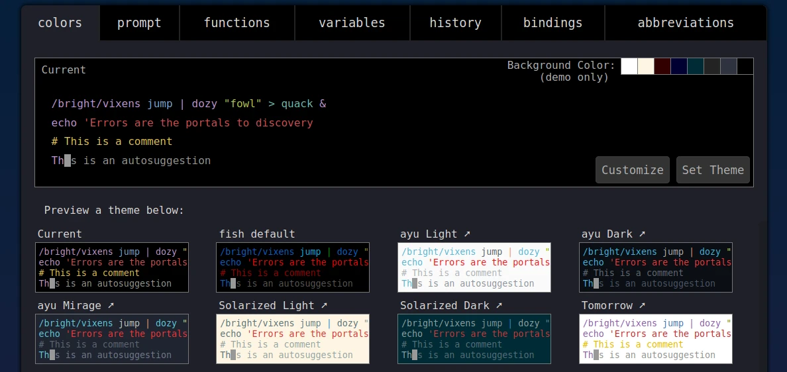

# Fish Shell

LangitKetujuh untuk pengguna normal secara bawaan menggunakan `fish-shell` sebagai shell utamanya. Tetapi bisa juga menggunakan shell lain seperti bash, ion, zsh dan sebagainya. Periksa shell yang digunakan dengan `echo $SHELL`. Cek ketersediaan shell yang ada di sistem dengan `chsh -l`.

## Konfigurasi dengan web

Fitur menarik dari fish-shell yaitu terdapat pengaturan berbasis web. Seperti mengatur warna tema, fungsi, singkatan, melihat perintah yang pernah diketik sebelumnya (history). Jalankan perintah dibawah ini untuk membuka konfigurasi melalui web.

```bash
fish_config
```



Untuk menghentikan proses, tekan enter di konsolenya.
