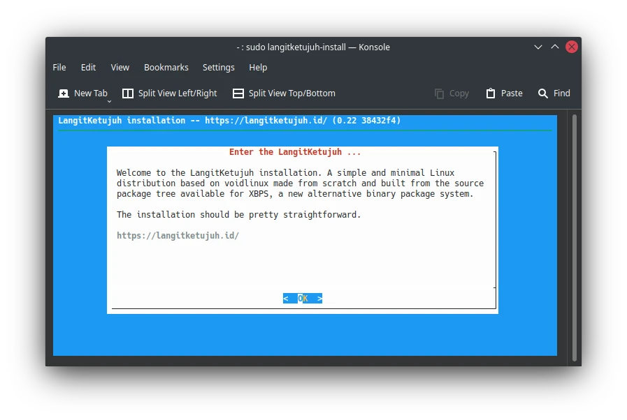

# Dual Boot Bersama Windows

## Metode

Pemasangan dual boot LangitKetujuh bersama Windows adalah sistem operasi windows sudah terpasang dan LangitKetujuh menjadi sistem operasi kedua.

## Menyiapkan partisi baru

Gunakan KDE Partition, GParted, GNOME Disk, `cfdisk` atau alat pemartisi lainnya. Lalu resize ruang partisi yang ada untuk digunakan partisi sistem LangitKetujuh.

Ruang diska       | Minimal         | Disarankan
:---              | :---            | :---
**Lite**          | 10 GiB          | 25 Gib
**Pro**           | 20 GiB          | 50 Gib

Berikut ini adalah contoh skema partisi didalam disk yang sudah memiliki partisi Windows.

```
➜  ~ lsblk -o NAME,TYPE,FSTYPE,SIZE,LABEL

NAME   TYPE FSTYPE    SIZE LABEL
sda    disk           498G                 
├─sda1 part ntfs       50M System Reserved
├─sda2 part ntfs      498M
└─sda3 part ntfs      497G windows
```

Sesudah dipartisi:

```
NAME   TYPE FSTYPE    SIZE LABEL
sda    disk           498G
├─sda1 part ntfs       50M System Reserved
├─sda2 part ntfs      498M
├─sda3 part ntfs      297G windows
├─sda4 part ext4       50G
└─sda5 part ext4      150G
```

Maka akan ada partisi baru yaitu:

* `sda4` dengan ukuran `50G`, yang akan dijadikan `/`
* `sda5` dengan ukuran `150G`, yang akan dijadikan `/home`

## Pemasangan

Aplikasi pemasang di LangitKetujuh OS tidak menggunakan GUI, tetapi menggunakan Ncurses CLI. Sehingga navigasinya menggunakan arah panah (⬆️ ➡️ ⬇️ ⬅️), `tab` dan `enter` di keyboard.
Buka aplikasi `konsole` di menu, kemudian ketik perintah berikut untuk menuju pemasang LangitKetujuh OS.

```bash
sudo langitketujuh-install
```



## Keyboard

Pilih `us` untuk jenis papan ketik `QWERTY`

## Network

Lewati tahap ini karena pemasangan sebaiknya dilakukan secara offline. Jika terlanjur terklik, pilih `Back` untuk kembali.`

## Source

Pilih `Local` untuk instalasi offline agar lebih cepat.

## Hostname

Hostname ditulis dengan huruf kecil. Bisa menggunakan nama brand komputer, nama website, atau nama keluarga. Contohnya `langitketujuh`, `linux`, `studio`, dsb.

## Locale

Pilih `en_US.UTF-8` untuk menggunakan Bahasa Inggris. Atau `id_ID.UTF-8` untuk menggunakan Bahasa Indonesia.

## Timezone

Untuk wilayah Indonesia pilih:

### WIB

* Benua: `Asia`
* Kota: `Jakarta`

### WITA

* Benua: `Asia`
* Kota: `Makassar`

### WIT

* Benua: `Asia`
* Kota: `Jayapura`

## Root Password

Masukkan kata sandi yang unik dan mudah diingat. Kemudian ketik lagi kata sandi untuk klarifikasi.

## User Account

> **Nama Pengguna (username)**
>
> Gunakan nama pengguna yang berbeda dengan pengguna distro linux yang lama agar tidak tumpang tindih, hal ini untuk membuat pengaturan baru untuk distro LangitKetujuh. Jika ingin menimpa, tidak mengapa untuk menggunakan username yang sama.

Nama pengguna (username) ditulis dengan huruf kecil. Bisa menggunakan nama panggilan. Contohnya `hervy`, `umar`, dsb.
Masukkan kata sandi yang unik dan mudah diingat. Kemudian ketik lagi kata sandi untuk klarifikasi.

Kemudian tulis nama pengguna untuk login (user login). Bisa menggunakan huruf kapital dan spasi. Misalnya `Hervy Qurrotul`, `Muhammad Rizal`, dsb.

Untuk "group membership" lewati saja dengan memilih `OK`.

## BootLoader

Bootloader tergantung dari letak disk yang terdapat partisi **/**. Biasanya menggunakan dari disk utama `/dev/sda`.

Pada dialog `use graphical boot loader` pilih `Yes`.

## Partition

> **Cadangkan data Hardisk Anda**
>
> Ketika merubah, mengganti, menambah dan mengurangi partisi. Sebaiknya Anda sudah mencadangkan ke disk eksternal atau cloud agar aman jika terjadi kesalahan teknis. Mohon tidak melanjutkan jika Anda tidak yakin dengan apa yang dilakukan.

Abaikan jika sudah melakukan pemartisian diawal, lalu lanjut ke tahap **Filesystems**. Jika belum diatur partisinya, pilih `/dev/sda` (disk saat ini). Modifikasi pilih `OK`. Pilih `cfdisk` lalu sesuaikan dengan kebutuhan partisi yang Anda inginkan. 

Berdasarkan dari contoh skema diatas, maka partisi yang akan digunakan terlihat seperti ini.

### BIOS (dos)

Nama Disk     | Bootable      | Jumlah    | Tipe    | Kondisi partisi
:---:         | :---:         | :---:     | :---:   | :---:
`/dev/sda4`   | *             |`50`       | `linux` | Baru
`/dev/sda5`   |               |`150G`     | `linux` | Baru

### UEFI (gpt)

Nama Disk     | ~~Bootable~~  | Jumlah    | Tipe    | Kondisi partisi
:---:         | :---:         | :---:     | :---:   | :---:
`/dev/sda2`   |               | `498M`    | `linux` | Lama
`/dev/sda4`   |               | `50`      | `linux` | Baru
`/dev/sda5`   |               | `150G`    | `linux` | Baru

* Baru = Partisinya diformat
* Lama = Partisinya tidak diformat

Jika sudah yakin, pilih `write` lalu ketik `yes`. Kemudian pilih `quit` untuk keluar.

## Filesystems

Pilih Nama disk kemudian pilih `Change`, lalu sesuaikan dengan kebutuhan _mount point_-nya. Berdasarkan skema partisi diatas maka eksekusi _mounting_ akan seperti berikut ini.

- `sda1` **Dilewati** karena partisi system reserved windows. Tidak diformat.
- `sda2` Khusus UEFI, akan dijadikan partisi `/boot/efi`. Tidak diformat.
- `sda3` **Dilewati** karena partisi sistem windows (localdisk:C ). Tidak diformat.
- `sda4` Partisi baru untuk sistem (`/`). Diformat.
- `sda5` Partisi baru untuk penyimpanan data (`/home`). Diformat.

### BIOS (dos)

Nama Disk   | Tipe Partisi  | Mount Point   | New Filesystems (Format)
:---:       | :---:         | :---:         | :---:
`/dev/sda4` | `Xfs`         | `/`           | **`yes`**
`/dev/sda5` | `Ext4`        | `/home`       | **`yes`**

### UEFI (gpt)

Nama Disk   | Tipe Partisi  | Mount Point   | New Filesystems (Format)
:---:       | :---:         | :---:         | :---:
`/dev/sda2` | `Vfat`        | `/boot/efi`   | **`no`**
`/dev/sda4` | `Xfs`         | `/`           | **`yes`**
`/dev/sda5` | `Ext4`        | `/home`       | **`yes`**

Jika sudah selesai pilih `Done`.

## Settings

Pilih `Settings` untuk melihat ringkasan pengaturan pemasangan yang akan dijalankan. Pada bagian partisi, nilai `1` artinya partisi akan diformat dan `0` partisi dibiarkan tetap.

## Install

Jika sudah yakin, Pilih `Install` dan `OK` untuk melanjutkan operasi pemasangan. Pilih `Yes` untuk memformat partisi sesuai pangaturan yang sudah direview `Settings` sebelumnya.

Tunggu proses hingga selesai hingga ada perintah untuk melakukan reboot. Pilih `Yes` untuk reboot. Setelah mesin mati, cabut flasdisk agar tidak kembali ke mode Live USB.

## Deteksi Windows

Setelah di restart kemudian masuk ke desktop LangitKetujuh. Untuk mendeteksi Windows gunakan `os-prober`.

```bash
sudo os-prober
sudo update-grub
```

Kemudian restart kembali, maka tampilan grub akan mendeteksi dual boot dengan Windows. Selesai.
