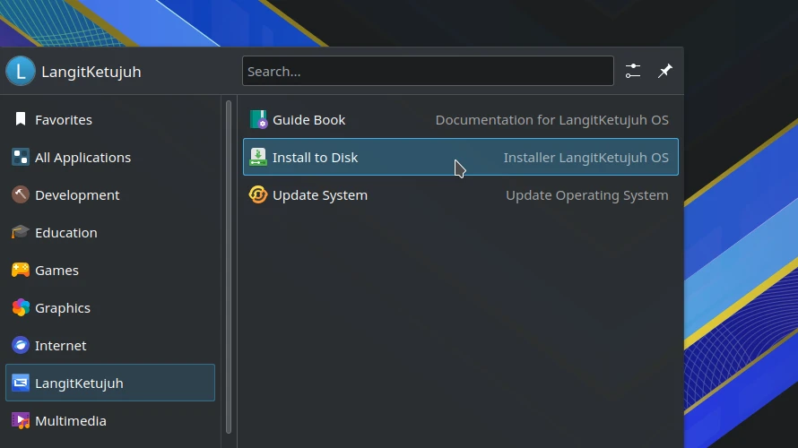
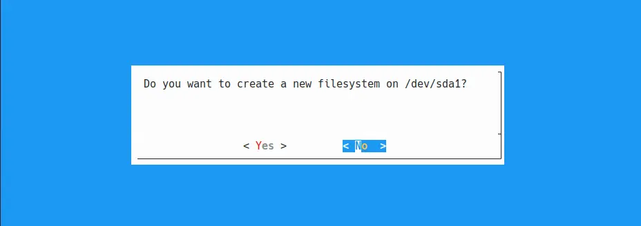
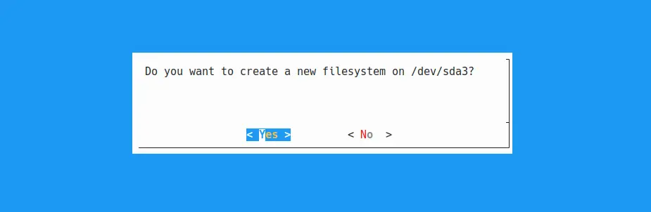
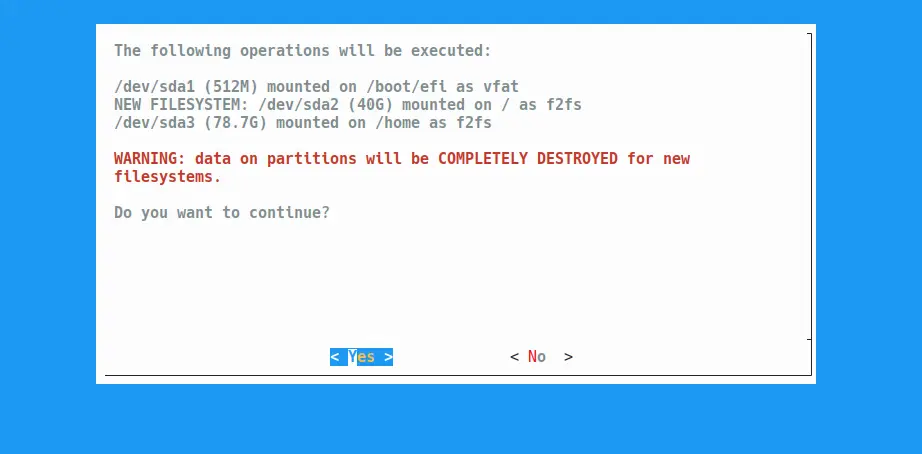

# Dual boot bersama windows

## Metode

Pemasangan dual boot dengan windows adalah menjadikan LangitKetujuh akan menjadi sistem operasi kedua. Dengan menggunakan partisi `/boot` atau `/boot/efi` lama jika ada.

## Menyiapkan partisi baru

Gunakan KDE Partition, GParted, GNOME Disk, `cfdisk` atau alat pemartisi lainnya. Lalu resize ruang partisi yang ada untuk digunakan partisi sistem LangitKetujuh.

| Ruang diska | Minimal | Disarankan |
| :---------- | :------ | :--------- |
| **Lite**    | 10 GiB  | 25 Gib     |
| **Studio**  | 20 GiB  | 40 Gib     |

```sh
lsblk -o NAME,TYPE,FSTYPE,SIZE,LABEL
```

- Skema partisi lama.

  ```sh
  NAME   TYPE FSTYPE    SIZE LABEL
  sda    disk           498G
  ├─sda1 part ntfs       50M System Reserved
  ├─sda2 part ntfs      498M
  └─sda3 part ntfs      497G windows
  ```

- Skema partisi baru. Pemartisian dengan Disk Management Windows dengan menambahkan partisi baru `40G` dan `160G`.

  ```sh
  NAME   TYPE FSTYPE    SIZE LABEL
  sda    disk           498G
  ├─sda1 part ntfs       50M System Reserved
  ├─sda2 part ntfs      498M
  ├─sda3 part ntfs      297G windows
  ├─sda4 part ext4       40G
  └─sda5 part ext4      160G
  ```

Sebagai contoh, terdapat partisi baru yaitu `sda4` dengan ukuran `40G` yang nantinya akan dijadikan partisi `/` untuk LangitKetujuh. Sedangkan partisi `/home` menggunakan `sda5` dengan partisi baru jika memungkinkan.

## Pemasangan

Perangkat lunak pemasang di LangitKetujuh OS tidak menggunakan GUI, tetapi menggunakan Ncurses CLI. Sehingga navigasinya menggunakan arah panah ⬆️ ➡️ ⬇️ ⬅️, `tab` dan `enter` di keyboard.

Buka menu `LangitKetujuh` > `Install to Disk`.



Atau menggunakan `konsole` di menu, kemudian ketik perintah berikut untuk menuju pemasang LangitKetujuh OS.

```sh
doas langitketujuh-install
```
Kata sandi: `langitketujuh`


Tekan `Enter` untuk melanjutkan ke pemasangan. Pengguna akan melihat langkah demi langkah tahapan yang harus diselesaikan. Seperti `Keyboard`, `Network`, `Source`, `Hostname` hingga ke `Install`.


### Keyboard

Pilih `us` untuk jenis papan ketik qwerty.


### Network

Lewati tahap ini karena pemasangan sebaiknya dilakukan secara offline. Jika terlanjur terklik, pilih `Back` untuk kembali.

### Source

Pilih `Local` untuk pemasangan offline agar lebih cepat prosesnya.


### Hostname

Hostname ditulis dengan huruf kecil. Bisa menggunakan nama brand komputer, nama website, atau nama keluarga. Contohnya `studio`, `langitketujuh`, `linux`, dsb.


### Locale

Pilih `en_US.UTF-8` untuk menggunakan Bahasa Inggris. Atau `id_ID.UTF-8` untuk menggunakan Bahasa Indonesia.


### Timezone

Pilih zona waktu benua yang dikehendaki, misalnya `Asia`.


Selanjutnya pilih zona waktu kota, misalnya `Jakarta` untuk zona waktu WIB. Pengguna juga dapat memilih zona waktu lainnya seperti `Makassar` untuk WITA atau `Jayapura` untuk WIT.


### Root Password

Masukkan kata sandi yang unik dan mudah diingat.

> 🔔 **Tips**
>
> Gunakan kata sandi dengan kombinasi angka dan huruf sekitar 5 karakter.


Kemudian ulangi lagi kata sandi yang sama untuk klarifikasi.


### User Account

Nama pengguna primer/utama ditulis dengan huruf kecil. Bisa menggunakan nama panggilan. Contohnya `myusuf`, `hervy`, `aziz`, `aris` dsb.


Kemudian tulis nama pengguna untuk login. Bisa menggunakan huruf kapital dan spasi. Misalnya `Muhammad Yusuf`, `Hervy Qurrotul`, `LangitKetujuh Studio` dsb.


Masukkan kata sandi yang unik dan mudah diingat.


Kemudian ketik lagi kata sandi yang sama untuk klarifikasi.


Untuk "group membership" lewati saja dengan memilih `OK`.


### BootLoader

Bootloader tergantung dari letak disk yang akan di partisi sebagai sistem root **/**. Biasanya menggunakan dari disk utama `/dev/sda`. Sebagai contoh `/dev/sda` SSD dengan ukuran 120GB.


Pada dialog `use graphical boot loader` pilih `Yes`.


### Partition

> ⚠️ **Peringatan**
>
> Ketika merubah, mengganti, menambah dan mengurangi partisi. Sebaiknya sudah mencadangkan ke disk eksternal atau cloud agar aman jika terjadi kesalahan teknis. Mohon tidak melanjutkan jika tidak yakin dengan apa yang dilakukan.

Abaikan jika sudah melakukan pemartisian diawal, lalu lanjut ke tahap **Filesystems**. Jika belum diatur partisinya, pilih `/dev/sda` (disk saat ini). Kemudian pilih `OK`.


Pilih `cfdisk` sebagai perkakas partisinya.


Muncul peringatan pemilihan file system untuk partisi boot, `Enter` untuk melanjutkan.


Dengan `cfdisk`, pengguna dapat mengatur partisinya seperti menambah partisi dengan memilih `New`, menghapus dengan memilih `Delete`, merubah ukuran dengan `Resize` dan lain sebagainya. Sesuaikanlah dengan kebutuhan partisi yang diinginkan.

Berikut ini adalah contoh skema partisi yang kami sarankan.

- **Legacy (dos/mbr)**

  |  Nama Disk  | Bootable | Jumlah |  Tipe   | Kondisi partisi |
  | :---------: | :------: | :----: | :-----: | :-------------: |
  | `/dev/sda4` |    *     |  `40`  | `linux` |      Baru       |
  | `/dev/sda5` |          | `160G` | `linux` |      Baru       |

- **UEFI (gpt)**

  |  Nama Disk  | Jumlah |  Tipe   | Kondisi partisi |
  | :---------: | :----: | :-----: | :-------------: |
  | `/dev/sda2` | `512M` |  `Efi`  |      Lama       |
  | `/dev/sda4` |  `40`  | `linux` |      Baru       |
  | `/dev/sda5` | `160G` | `linux` |      Baru       |

  * Baru = Partisinya diformat
  * Lama = Partisinya tidak diformat
  * Partisi `sda1` akan digunakan sebagai `/boot` atau `/boot/efi`.

Jumlah gigabyte dari `/dev/sda5` bisa ditulis dari sisa kapasitas hardisk yang ada atau disesuaikan dengan kebutuhan saja.

Jika sudah yakin, pilih `write` lalu ketik `yes`. Kemudian pilih `quit` untuk keluar.


### Filesystems

> 🔔 **Tips**
>
> Khusus SSD untuk bagian partisi root disarankan menggunakan `F2fs`, sedangkan HDD menggunakan `XFS`, `Btrfs` atau `Ext4`.

Filesystem akan menentukan setiap partisi untuk digunakan dalam mountpoint hirarki sistem operasi. Umumnya terdiri dari 3 mountpoint, yaitu:

  1. `/boot` atau `/boot/efi`
  2. `/`
  3. `/home`

Berdasarkan skema partisi diatas maka mountpoint filesystem akan seperti berikut ini.

- `sda1` **Dilewati** karena partisi system reserved windows. Tidak diformat.
- `sda2` Khusus UEFI, akan dijadikan partisi `/boot/efi`. Tidak diformat.
- `sda3` **Dilewati** karena partisi sistem windows (localdisk:C). Tidak diformat.
- `sda4` Partisi baru untuk sistem `/`. Diformat.
- `sda5` Partisi baru untuk penyimpanan data `/home`. Diformat.

Sedangkan untuk pemilihan mountpoint akan terlihat seperti berikut ini.

- **Legacy (dos/mbr)**

  |  Nama Disk  | Tipe Partisi | Mount Point | New Filesystems (Format) |
  | :---------: | :----------: | :---------: | :----------------------: |
  | `/dev/sda4` |    `Xfs`     |     `/`     |          `yes`           |
  | `/dev/sda5` |    `Ext4`    |   `/home`   |          `yes`           |

- **UEFI (gpt)**

  |  Nama Disk  | Tipe Partisi | Mount Point | New Filesystems (Format) |
  | :---------: | :----------: | :---------: | :----------------------: |
  | `/dev/sda2` |    `Vfat`    | `/boot/efi` |           `no`           |
  | `/dev/sda4` |    `Xfs`     |     `/`     |          `yes`           |
  | `/dev/sda5` |    `Ext4`    |   `/home`   |          `yes`           |

Pada cuplikan gambar dibawah ini merupakan contoh skema partisi dengan menggunakan SSD di mode UEFI.

- **Bagian 1**, partisi `/dev/sda2`. Pilih partisi pertama untuk boot. Kemudian pilih tipe `vfat` untuk dijadikan partisi boot `/boot/efi`.

  

  Ketik mount point yang dikehendaki, yaitu `/boot/efi`.

  

  Pilih `No` agar partisi EFI tidak terhapus, sebab metode pemasangan bersama windows ini mempertahankan partisi EFI yang sebelumnya.

  

- **Bagian 2**, partisi `/dev/sda4`. Pilih partisi keempat untuk dijadikan sistem root `/`. Kemudian pilih tipe `f2fs` untuk SSD di partisi root.

  

  Ketik mount point yang dikehendaki, yaitu `/`.

  

  Pilih untuk membuat file system root baru. Hal ini akan menghapus partisi tersebut.

  

- **Bagian 3**, partisi `/dev/sda5`. Pilih partisi kelima untuk dijadikan `/home`. Kemudian pilih tipe `f2fs` untuk SSD di partisi root.

  

  Ketik mount point yang dikehendaki, yaitu `/home`.

  

  Pilih untuk membuat file system home baru. Hal ini akan menghapus partisi tersebut.

  

  Jika sudah selesai pilih `Done`.

  <!---->

### Settings

Pilih `Settings` untuk melihat ringkasan pengaturan pemasangan yang akan dijalankan.


<!---->

Gulir ke bawah akan mendapati pengaturan partisinya. Pada bagian `MOUNTPONT`, nilai `1` artinya partisi akan diformat dan `0` partisi dibiarkan tetap.

<!---->

Tekan `Exit` untuk keluar dari ringkasan pengaturan.

### Install

Jika sudah yakin, Pilih `Install` dan `OK` untuk melanjutkan operasi pemasangan. Pilih `Yes` untuk memformat partisi sesuai pangaturan yang sudah diringkas pengaturan `Settings` sebelumnya.

> ⚠️ **Peringatan**
>
> Adanya penghapusan partisi jika tertulis NEW FILESYSTEM.

<!---->

Tunggu proses hingga selesai hingga ada perintah untuk melakukan reboot. Pilih `Yes` untuk reboot. Setelah mesin mati, cabut flasdisk agar tidak kembali ke mode Live USB.

## Pasca pemasangan

Setelah berhasil memasang sistem operasi LangitKetujuh, disarankan untuk [memperbarui sistem operasi](../../konfigurasi/pembaruan.md) agar memperoleh versi yang terbaru.

## Mendeteksi Windows

Untuk menampilkan Windows di grub menu dapat dilakukan dengan cara [memperbarui sistem operasi](../../konfigurasi/pembaruan.md), maka secara otomatis akan menampilkan daftar grub LangitKetujuh dengan Windows ketika direboot kembali.

Cara lainnya dengan menjalankan perintah dibawah ini di konsole.

```sh
doas l7-tools --patch
```
