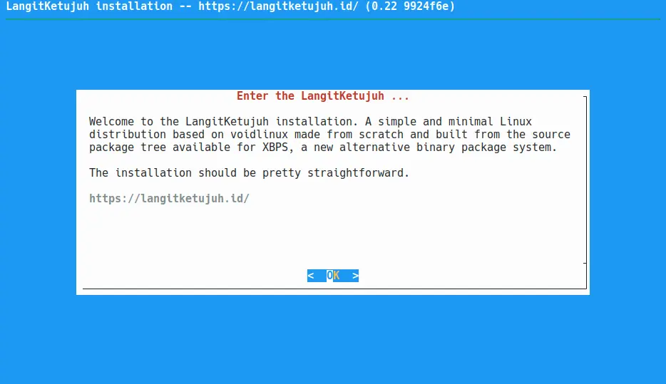
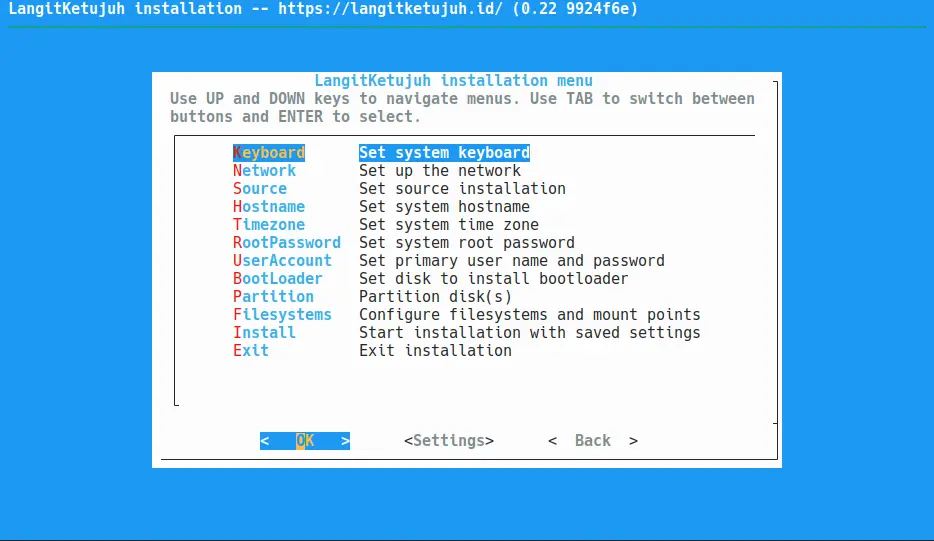
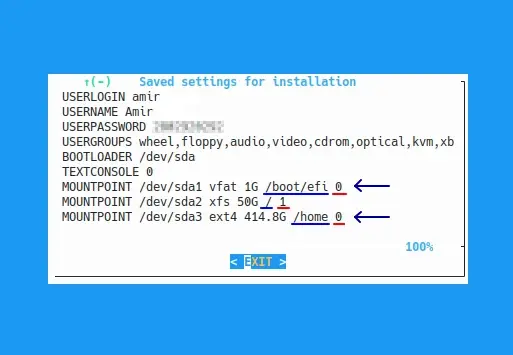

# Single Boot Pasang Ulang

## Metode

Pemasangan single boot pasang ulang artinya pemasangan LangitKetujuh yang terdapat partisi `/home` dan ingin mempertahankannya. Jika tidak mempunyai partisi `/home` maka Anda cadangkan data dahulu ke disk eksternal atau ke cloud.

## Pemasangan

Aplikasi pemasang di LangitKetujuh OS tidak menggunakan GUI, tetapi menggunakan Ncurses CLI. Sehingga navigasinya menggunakan arah panah (⬆️ ➡️ ⬇️ ⬅️), `tab` dan `enter` di keyboard.
Buka aplikasi `konsole` di menu, kemudian ketik perintah berikut untuk menuju pemasang LangitKetujuh OS.

```bash
doas langitketujuh-install
```
Kata sandinya: `langitketujuh`



Tekan `Enter` untuk melanjutkan ke pemasangan. Anda akan melihat langkah demi langkah tahapan yang harus diselesaikan. Seperti `Keyboard`, `Network`, `Source`, `Hostname` hingga ke `Install`.



### Keyboard

Pilih `us` untuk jenis papan ketik qwerty.

### Network

Lewati tahap ini karena pemasangan sebaiknya dilakukan secara offline. Jika terlanjur terklik, pilih `Back` untuk kembali.

### Source

Pilih `Local` untuk pemasangan offline agar lebih cepat prosesnya.

### Hostname

Hostname ditulis dengan huruf kecil. Bisa menggunakan nama brand komputer, nama website, atau nama keluarga. Contohnya `langitketujuh`, `linux`, `studio`, dsb.

### Locale

Pilih `en_US.UTF-8` untuk menggunakan Bahasa Inggris. Atau `id_ID.UTF-8` untuk menggunakan Bahasa Indonesia.

### Timezone

Jika berada di daerah zona waktu WIB, pilih `Asia` lalu `Jakarta`. Anda juga dapat memilih zona waktu lain seperti Makassar atau Jayapura.

| WIB       | WITA      | WIT       |
| :---:     | :---:     | :---:     |
| Asia      | Asia      | Asia      |
| Jakarta   | Makassar  | Jayapura  |

### Root Password

Masukkan kata sandi yang unik dan mudah diingat. Mengetik kata sandi memang tidak terlihat, tetapi sebenarnya sudah terketik. Kemudian ulangi lagi kata sandi yang sama untuk klarifikasi.

### User Account

Nama pengguna (username) ditulis dengan huruf kecil. Bisa menggunakan nama panggilan. Contohnya `hervy`, `aziz`, `aris` dsb.
Masukkan kata sandi yang unik dan mudah diingat. Kemudian ketik lagi kata sandi yang sama untuk klarifikasi.

Kemudian tulis nama pengguna untuk login (userlogin). Bisa menggunakan huruf kapital dan spasi. Misalnya `Hervy Qurrotul`, `LangitKetujuh Studio` dsb.

Untuk "group membership" lewati saja dengan memilih `OK`.

### BootLoader

Bootloader tergantung dari letak disk yang terdapat partisi **/**. Biasanya menggunakan dari disk utama `/dev/sda`.

Pada dialog `use graphical boot loader` pilih `Yes`.

### Partition

> **Cadangkan data Hardisk Anda**
>
> Ketika merubah, mengganti, menambah dan mengurangi partisi. Sebaiknya Anda sudah mencadangkan ke disk eksternal atau cloud agar aman jika terjadi kesalahan teknis. Mohon tidak melanjutkan jika Anda tidak yakin dengan apa yang dilakukan.

Abaikan jika sudah melakukan pemartisian diawal, lalu lanjut ke tahap **Filesystems**. Jika belum diatur partisinya, pilih `/dev/sda` (disk saat ini). Modifikasi pilih `OK`. Pilih `cfdisk` lalu sesuaikan dengan kebutuhan partisi yang Anda inginkan. Misalnya seperti partisi dibawah ini.

#### A. Legacy (dos/mbr)

Nama Disk     | Bootable      | Jumlah    | Tipe    | Kondisi partisi
:---:         | :---:         | :---:     | :---:   | :---:
`/dev/sda1`   | *             | `1G`      | `linux` | Baru
`/dev/sda2`   |               | `50G`     | `linux` | Baru
`/dev/sda3`   |               | `~`       | `linux` | Lama

#### B. UEFI (gpt)

Nama Disk     | ~~Bootable~~  | Jumlah    | Tipe    | Kondisi partisi
:---:         | :---:         | :---:     | :---:   | :---:
`/dev/sda1`   |               | `1G`      | `linux` | Lama
`/dev/sda2`   |               | `50G`     | `linux` | Baru
`/dev/sda3`   |               | `~`       | `linux` | Lama

* Baru = Partisinya diformat
* Lama = Partisinya tidak diformat
* Partisi untuk `/home` tidak perlu dibuat karena masih menggunakan pastisi yang lama dan jangan diformat.

Partisi `/dev/sda3` tidak perlu dibuat, karena sudah ada dari pemartisian linux sebelumnya. Jika sudah yakin, pilih `write` lalu ketik `yes`. Kemudian pilih `quit` untuk keluar.

### Filesystems

Pilih Nama disk kemudian pilih `Change`, lalu sesuaikan dengan kebutuhan _mount point_-nya

> **Partisi /home**
>
> Partisi tersebut tidak diformat atau dihapus. Jadi pada bagian "Choose New Filesystems" pilih "**No**".

#### A. Legacy (dos/mbr)

Nama Disk   | Tipe Partisi  | Mount Point   | New Filesystems (Format)
:---:       | :---:         | :---:         | :---:
`/dev/sda1` | `Vfat`        | `/boot`       | `yes`
`/dev/sda2` | `XFS`         | `/`           | `yes`
`/dev/sda3` | `Ext4`        | `/home`       | **`no`**

#### B. UEFI (gpt)

Nama Disk   | Tipe Partisi  | Mount Point   | New Filesystems (Format)
:---:       | :---:         | :---:         | :---:
`/dev/sda1` | `Vfat`        | `/boot/efi`   | **`no`**
`/dev/sda2` | `XFS`         | `/`           | `yes`
`/dev/sda3` | `Ext4`        | `/home`       | **`no`**

Jika sudah selesai pilih `Done`.

### Settings

Pilih `Settings` untuk melihat ringkasan pengaturan pemasangan yang akan dijalankan. Pada bagian partisi, nilai `1` artinya partisi akan diformat dan `0` partisi dibiarkan tetap.

Contoh pengaturan di mode UEFI:



### Install

Jika sudah yakin, Pilih `Install` dan `OK` untuk melanjutkan operasi pemasangan. Pilih `Yes` untuk memformat partisi sesuai pangaturan yang sudah direview `Settings` sebelumnya.

Tunggu proses hingga selesai hingga ada perintah untuk melakukan reboot. Pilih `Yes` untuk reboot. Setelah mesin mati, cabut flasdisk agar tidak kembali ke mode Live USB.
