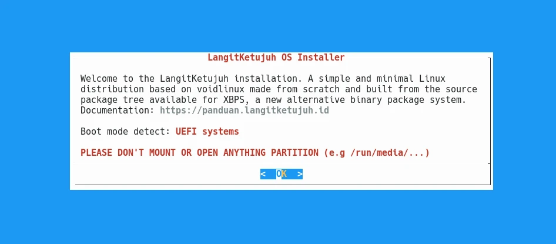

# Single Boot Pasang Ulang

## Metode

Pemasangan single boot pasang ulang artinya pemasangan LangitKetujuh yang terdapat partisi `/home` dan ingin mempertahankannya. Jika tidak mempunyai partisi `/home` maka cadangkan data dahulu ke disk eksternal atau ke cloud.

## Pemasangan

Perangkat lunak pemasang di LangitKetujuh OS tidak menggunakan GUI, tetapi menggunakan Ncurses CLI. Sehingga navigasinya menggunakan arah panah ⬆️ ➡️ ⬇️ ⬅️, `tab` dan `enter` di keyboard.
Buka perangkat lunak `konsole` di menu, kemudian ketik perintah berikut untuk menuju pemasang LangitKetujuh OS.

```bash
doas langitketujuh-install
```
Kata sandinya: `langitketujuh`



Tekan `Enter` untuk melanjutkan ke pemasangan. Pengguna akan melihat langkah demi langkah tahapan yang harus diselesaikan. Seperti `Keyboard`, `Network`, `Source`, `Hostname` hingga ke `Install`.


### Keyboard

Pilih `us` untuk jenis papan ketik qwerty.


### Network

Lewati tahap ini karena pemasangan sebaiknya dilakukan secara offline. Jika terlanjur terklik, pilih `Back` untuk kembali.

### Source

Pilih `Local` untuk pemasangan offline agar lebih cepat prosesnya.


### Hostname

Hostname ditulis dengan huruf kecil. Bisa menggunakan nama brand komputer, nama website, atau nama keluarga. Contohnya `studio`, `langitketujuh`, `linux`, dsb.


### Locale

Pilih `en_US.UTF-8` untuk menggunakan Bahasa Inggris. Atau `id_ID.UTF-8` untuk menggunakan Bahasa Indonesia.


### Timezone

Pilih zona waktu benua yang dikehendaki, misalnya `Asia`.


Selanjutnya pilih zona waktu kota, misalnya `Jakarta` untuk zona waktu WIB. Pengguna juga dapat memilih zona waktu lainnya seperti `Makassar` untuk WITA atau `Jayapura` untuk WIT.


### Root Password

Masukkan kata sandi yang unik dan mudah diingat.

> 🔔 Gunakan kata sandi dengan kombinasi angka dan huruf sekitar 5 karakter.


Kemudian ulangi lagi kata sandi yang sama untuk klarifikasi.


### User Account

Nama pengguna primer/utama ditulis dengan huruf kecil. Bisa menggunakan nama panggilan. Contohnya `myusuf`, `hervy`, `aziz`, `aris` dsb.


Kemudian tulis nama pengguna untuk login. Bisa menggunakan huruf kapital dan spasi. Misalnya `Muhammad Yusuf`, `Hervy Qurrotul`, `LangitKetujuh Studio` dsb.


Masukkan kata sandi yang unik dan mudah diingat.


Kemudian ketik lagi kata sandi yang sama untuk klarifikasi.


Untuk "group membership" lewati saja dengan memilih `OK`.


### BootLoader

Bootloader tergantung dari letak disk yang akan di partisi sebagai sistem root **/**. Biasanya menggunakan dari disk utama `/dev/sda`. Sebagai contoh `/dev/sda` SSD dengan ukuran 120GB.


Pada dialog `use graphical boot loader` pilih `Yes`.


### Partition

> ⚠️ **Cadangkan data Hardisk**
>
> Ketika merubah, mengganti, menambah dan mengurangi partisi. Sebaiknya sudah mencadangkan ke disk eksternal atau cloud agar aman jika terjadi kesalahan teknis. Mohon tidak melanjutkan jika tidak yakin dengan apa yang dilakukan.

Abaikan jika sudah melakukan pemartisian diawal, lalu lanjut ke tahap **Filesystems**. Jika belum diatur partisinya, pilih `/dev/sda` (disk saat ini). Kemudian pilih `OK`.


Pilih `cfdisk` sebagai perkakas partisinya.


Muncul peringatan pemilihan file system untuk partisi boot, `Enter` untuk melanjutkan.


Dengan `cfdisk`, pengguna dapat mengatur partisinya seperti menambah partisi dengan memilih `New`, menghapus dengan memilih `Delete`, merubah ukuran dengan `Resize` dan lain sebagainya. Sesuaikanlah dengan kebutuhan partisi yang diinginkan.

Berikut ini adalah contoh skema partisi yang kami sarankan.

- **Legacy (dos/mbr)**

  Jika menggunakan legacy, pastikan partisi boot sudah mengaktifkan tanda bintang `*` sebagai tanda bootable. Khusus untuk legacy saja.

  |  Nama Disk  | Bootable | Jumlah |  Tipe   | Kondisi partisi |
  | :---------: | :------: | :----: | :-----: | :-------------: |
  | `/dev/sda1` |    *     | `512M` | `linux` |      Baru       |
  | `/dev/sda2` |          | `40G`  | `linux` |      Baru       |
  | `/dev/sda3` |          |  `~`   | `linux` |      Lama       |

- **UEFI (gpt)**

  Jika menggunakan UEFI, maka langsung saja membuat partisinya seperti contoh berikut ini.

  |  Nama Disk  | Jumlah |  Tipe   | Kondisi partisi |
  | :---------: | :----: | :-----: | :-------------: |
  | `/dev/sda1` | `512M` | `linux` |      Baru       |
  | `/dev/sda2` | `40G`  | `linux` |      Baru       |
  | `/dev/sda3` |  `~`   | `linux` |      Lama       |

  * Baru = Partisinya diformat
  * Lama = Partisinya tidak diformat
  * Partisi untuk `/home` tidak perlu dibuat karena masih menggunakan pastisi yang lama dan jangan diformat.

Partisi `/dev/sda3` tidak perlu dibuat, karena sudah ada dari pemartisian linux sebelumnya.


Jika sudah yakin, pilih `write` lalu ketik `yes`. Kemudian pilih `quit` untuk keluar.


### Filesystems

> 🔔 Khusus SSD untuk bagian partisi root disarankan menggunakan `F2fs`, sedangkan HDD menggunakan `XFS`, `Btrfs` atau `Ext4`.

Filesystem akan menentukan setiap partisi untuk digunakan dalam mountpoint hirarki sistem operasi. Umumnya terdiri dari 3 mountpoint, yaitu:

  1. `/boot` atau `/boot/efi`
  2. `/`
  3. `/home`

Berikut ini adalah contoh skema filesystem yang kami sarankan.

- **Legacy (dos/mbr)**

  Jika menggunakan legacy maka menggunakan `/boot`.

  |  Nama Disk  | Tipe Partisi | Mount Point | New Filesystems (Format) |
  | :---------: | :----------: | :---------: | :----------------------: |
  | `/dev/sda1` |    `Vfat`    |   `/boot`   |          `yes`           |
  | `/dev/sda2` |    `XFS`     |     `/`     |          `yes`           |
  | `/dev/sda3` |    `Ext4`    |   `/home`   |         **`no`**         |

- **UEFI (gpt)**

  Jika menggunakan UEFI maka menggunakan `/efi/boot`.

  |  Nama Disk  | Tipe Partisi | Mount Point | New Filesystems (Format) |
  | :---------: | :----------: | :---------: | :----------------------: |
  | `/dev/sda1` |    `Vfat`    | `/boot/efi` |          `yes`           |
  | `/dev/sda2` |    `XFS`     |     `/`     |          `yes`           |
  | `/dev/sda3` |    `Ext4`    |   `/home`   |         **`no`**         |

Pada cuplikan gambar dibawah ini merupakan contoh skema partisi dengan menggunakan SSD di mode UEFI.

- **Bagian 1**, partisi `/dev/sda1`. Pilih partisi pertama untuk boot.

  

  Kemudian  pilih tipe `vfat` untuk dijadikan partisi boot `/boot/efi`.

  

  Ketik mount point yang dikehendaki, yaitu `/boot/efi`.

  

  Pilih untuk membuat file system boot baru. Hal ini akan menghapus partisi tersebut.

  

- **Bagian 2**, partisi `/dev/sda2`. Pilih partisi kedua untuk dijadikan sistem root `/`.

  

  Kemudian pilih tipe `f2fs` untuk SSD di partisi root.

  

  Ketik mount point yang dikehendaki, yaitu `/`.

  

  Pilih untuk membuat file system root baru. Hal ini akan menghapus partisi tersebut.

  

- **Bagian 3**, partisi `/dev/sda3`. Pilih partisi ketiga untuk dijadikan `/home`.

  

  Kemudian pilih tipe `f2fs` untuk SSD di partisi home.

  

  Ketik mount point yang dikehendaki, yaitu `/home`.

  

  > ⚠️ Khusus partisi /home

  Pilih `No` agar partisi home tidak terhapus, sebab metode pemasangan ulang ini mempertahankan partisi home yang sebelumnya.

  

  Jika sudah selesai pilih `Done`.

  

### Settings

Pilih `Settings` untuk melihat ringkasan pengaturan pemasangan yang akan dijalankan.


Gulir ke bawah akan mendapati pengaturan partisinya. Pada bagian `MOUNTPONT`, nilai `1` artinya partisi akan diformat dan `0` partisi dibiarkan tetap.


Tekan `Exit` untuk keluar dari ringkasan pengaturan.

### Install

Jika sudah yakin, Pilih `Install` dan `OK` untuk melanjutkan operasi pemasangan. Pilih `Yes` untuk memformat partisi sesuai pangaturan yang sudah diringkas pengaturan `Settings` sebelumnya.

> ⚠️ Adanya penghapusan partisi jika tertulis NEW FILESYSTEM


Tunggu proses hingga selesai hingga ada perintah untuk melakukan reboot. Pilih `Yes` untuk reboot. Setelah mesin mati, cabut flasdisk agar tidak kembali ke mode Live USB.

## Pasca pemasangan

Setelah berhasil memasang sistem operasi LangitKetujuh, disarankan untuk [memperbarui sistem operasi](../../konfigurasi/pembaruan.md) agar memperoleh versi yang terbaru.
