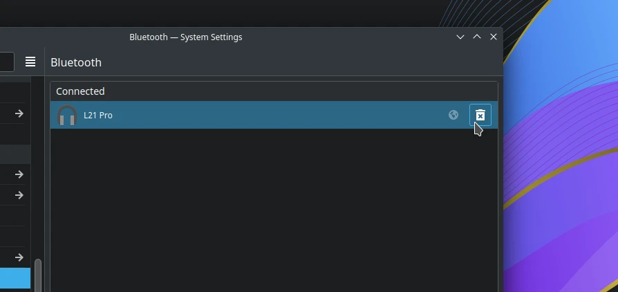
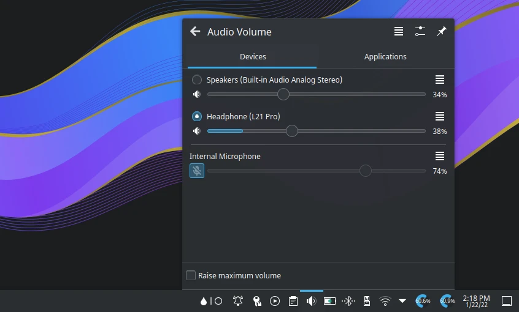

# Audio hilang

## Gunakan pipewire server

Saat ini LangitKetujuh OS telah menggunakan Pipewire sebagai server audio, jika sebelumnya menggunakan pulseaudio maka ikuti panduan pemasangan pipewire [di halaman ini](../konfigurasi/multimedia/pipewire.html#memasang-pipewire).

## Nonaktifkan snd-aloop modul

Periksa modul snd-aloop aktif atau tidaknya.

```sh
cat /etc/modules-load.d/snd-aloop.conf
```

Jika hasilnya kosong atau `#snd-aloop` dengan tanda pagar maka modulnya sudah tidak aktif, tetapi jika keluarannya `snd-aloop` maka modulnya aktif. Untuk menonaktifkannya, hapus konfigurasi modul snd-aloop dengan menjalankan perintah dibawah ini.

```sh
doas rm /etc/modules-load.d/snd-aloop.conf
```

Kemudian reboot agar terjadi perubahannya.

## Driver Nvidia

Jika menggunakan GPU Nvidia, maka pasang driver yang proprietary agar audio dapat berjalan dengan semestinya. Panduannya ada di [halaman Nvidia](../konfigurasi/driver/grafis/nvidia.html#nvidia).

## Audio bluetooth

Biasanya bluetooth tidak otomatis menerima audio dari komputer untuk pertama kalinya. Sebab, secara bawaan output audio ke `builtin analog audio` bukan ke audio bluetooth.

Kendala lainnya yaitu bluetooth tidak berhasil disambungkan. Solusinya dengan memasang `libspa-bluetooth` dan menambahkan grup pengguna ke bluetooth.

```sh
doas xbps-install libspa-bluetooth
doas usermod -aG bluetooth $USER
```

Kemudian logout komputernya. Cara diatas hanya untuk iso rilis `20210923` dan sebelumnya, untuk iso versi terbaru sudah terkonfigurasi.

Selanjutnya, hapus daftar speaker/headset yang sebelumnya sudah pernah tersambung di pengaturan `Bluetooth` dengan mengklik ikon tong sampah.



Hentikan sementara dan aktifkan kembali layanan bluetoothd dengan menjalankan:

```sh
doas sv stop bluetoothd; sleep 3; doas sv start bluetoothd
```

Kemudian sambungkan kembali bluetoothnya ke speaker/headset. Secara sepintas akan terlihat notifikasi perpindahan ke audio bluetooth. Setelah tersambung, besarnya suara dapat diatur di volume sistem tray.

Jika belum tersambung, ulangi lagi perintah seperti diatas. Gambar dibawah ini kami menggunakan TWS `L21 Pro`.



## Perangkat audio tidak terdeteksi

Ada beberapa faktor jika terjadi demikian, diantaranya:

- Komputer tidak ada sound card, solusinya pasang dan periksa sound card.
- Komputer belum tersambung dengan headset atau speaker, solusinya cek perangkatnya tersambung ke port usb atau tidak.
- Perangkat audio yang tidak didukung oleh kernel linux, solusinya ganti kernel sebelumnya atau memasang kernel lts (cara ini belum tentu berhasil, tergantung dari sound card).
  - Pasang kernel lts.
  ```sh
  doas xbps-install linux-lts{,-headers}
  ```
  - Nyalakan ulang komputer. Pilih `Advanced Option`. Pilih versi kernel linux lts, misalnya `linux5.10`.
