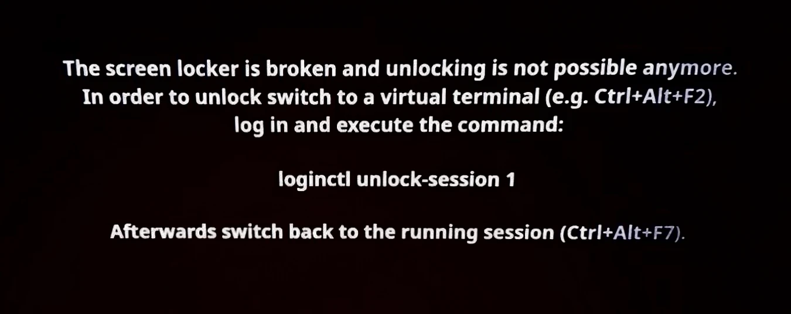

# Masalah SDDM

## Unlock Session

Pengguna tiba-tiba menemui error seperti ini saat memperbarui sistem yang sedang berlangsung.



Ini terjadi ketika terjadi perubahan sesi login dan saat update dengan ukuran yang cukup besar, sehingga sesi sddm harus dibuka kembali. Biasanya muncul karena sistemnya jarang diperbarui atau masih baru pertama kali install. Maka solusinya adalah sebagai berikut.

Tekan `Ctrl+Alt+F2` untuk masuk ke mode TTY2. Jika menggunakan vendor Lenovo, biasanya menambahkan tombol kombinasi `Fn+` menjadi `Fn+Ctrl+Alt+F2`.

```sh
Username: pengguna
Password: (kata sandi)
```

Pada `Username:` isikan nama pengguna, misalnya `ayusuf`. Kemudian masukkan kata sandi.
Ingat, mengisi sandi ini tidak ditampilkan sehingga wajar akan tampak kosong, padahal sebenarnya sudah terketik.

Jika sudah masuk ke TTY2 maka akan terlihat tanda tilde `➜  ~`. Jalankan perintah ini:

```
loginctl unlock-session 1
```

Kembali ke TTY7 dengan menekan `Ctrl+Alt+F7` dan layar akan kembali normal. Kemudian lanjutkan proses [pembaruan sistem] yang sempat terhenti sebelumnya, ini penting agar tidak terjadi `error while loading shared libraries` seperti dibawah ini.

## Error while loading shared libraries

Pengguna menemui error seperti ini ketika baru menyalakan komputer:


Hal ini terjadi karena sebelumnya sedang pembaruan sistem, tetapi pembaruan tersebut belum selesai lalu di reboot. Biasanya terjadi error seperti diatas.

Penyebab utamanya karena pembaruan belum selesai, sehingga harus dilanjutkan proses pembaruan sistemnya dengan mode TTY.

Tekan `Ctrl+Alt+F2` untuk masuk ke mode TTY2. Jika menggunakan vendor Lenovo, biasanya menambahkan tombol kombinasi `Fn+` menjadi `Fn+Ctrl+Alt+F2`.

```sh
Username: pengguna
Password: (kata sandi)
```

Pada `Username:` isikan nama pengguna, misalnya `ayusuf`. Kemudian masukkan kata sandi.
Ingat, mengisi sandi ini tidak ditampilkan sehingga wajar akan tampak kosong, padahal sebenarnya sudah terketik.

Jika sudah masuk ke TTY2 maka akan terlihat tanda tilde `➜  ~`. Jalankan perintah ini untuk menyambungkan ke internet:

```
nmtui
```

Lalu koneksikan ke jaringan yang tersedia. Gunakan arah panah ⬆️ ➡️ ⬇️ ⬅️, `tab` dan `enter` di keyboard. Pilih `Activate a connection`, pilih jaringan yang ada dan masukkan kata sandi bila diperlukan. Jika sudah tersambung, pilih `Back` untuk kembali dan `Quit` untuk keluar.

Kemudian lanjutkan proses pembaruan sistem yang belum selesai.

```
upgrade
```

Jika sudah selesai, maka reboot untuk menyalakan kembali komputernya.

```
doas reboot
```

[pembaruan sistem]:../konfigurasi/pembaruan.md
