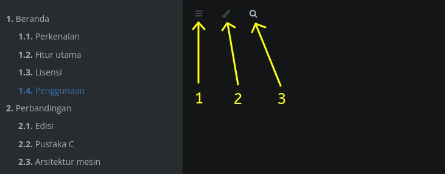
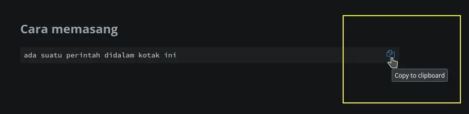

# Penggunaan

## Menu ikon

Didalam panduan ini memiliki menu ikon. Fungsi dari ikon-ikon tersebut antara lain:

1. Membuka atau menutup sidebar tabel dari konten.
2. Mengganti tema tampilan.
3. Melakukan pencarian kata kunci yang dikehendaki.

## Menyalin perintah

Jika pengguna menemui kotak perintah seperti dibawah ini, maka gunakan ikon `clipboard` untuk menyalin (copy) ke dalam konsole.

Kemudian tempel (paste) ke konsole dengan cara menekan `ctrl+shift+v` atau klik kanan pilih `Paste`.
